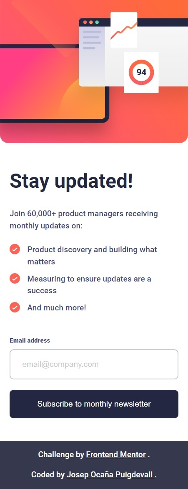

# Frontend Mentor - Newsletter sign-up form with success message solution

Hi everyone!!! 😉

This is my solution to the [Newsletter sign-up form with success message challenge on Frontend Mentor](https://www.frontendmentor.io/challenges/newsletter-signup-form-with-success-message-3FC1AZbNrv). Frontend Mentor challenges help you improve your coding skills by building realistic projects.

## Table of contents

-   [Overview](#overview)
    -   [The challenge](#the-challenge)
    -   [Screenshot](#screenshot)
    -   [Links](#links)
-   [My process](#my-process)
    -   [Built with](#built-with)
    -   [What I learned](#what-i-learned)
    -   [Continued development](#continued-development)
    -   [Useful resources](#useful-resources)
-   [Author](#author)
-   [Acknowledgments](#acknowledgments)

## Overview

### The challenge

Users should be able to:

-   Add their email and submit the form
-   See a success message with their email after successfully submitting the form
-   See form validation messages if:
    -   The field is left empty
    -   The email address is not formatted correctly
-   View the optimal layout for the interface depending on their device's screen size
-   See hover and focus states for all interactive elements on the page

### Screenshot

#### Desktop


#### Active states


#### desktop success


#### Error states


#### Mobile design



#### Mobile success


### Links

-   Solution URL: [@Josep-Ocana-newsletter-project](https://github.com/Josep-Ocana/frontendMentor-newsletter)
-   Live Site URL: [@Josep-Ocana-newsletter-page](https://frontend-mentor-josep-newsletter.netlify.app/)

## My process

### Built with

-   Semantic HTML5 markup
-   CSS custom properties
-   Flexbox
-   CSS Grid

### What I learned

In this project I've worked with forms in js and alert messages.

I established knowledge about write js code in separate files to do easy the maintenance of my projects.

-   In my CSS code I use _classes_ to do styles both containers and so I use less code. and then change one of them if I need it using _id_.

```css
.container {
	display: flex;
	flex-direction: row-reverse;
	justify-content: space-between;
	gap: 3rem;
	max-width: 56.7rem;
	padding: 24px;
	border-radius: 2rem;
	background-color: var(--white);
}
... #success-container {
	flex-direction: column;
	justify-content: center;
	gap: 0;
	max-width: 30rem;
	padding: 3.5rem;
}
```

-   In Js I've used expression IIFE to protect variables.

```js
(function () {
	...
    const formEmail = document.querySelector('#form');
	formEmail.addEventListener('submit', validateForm);
})();
```

### Continued development

I want to focus in the three pillars for building web pages: CSS, HTML, and JS and I want to start learnig REACT soon to do my webs more efficient and with reusable code.

### Useful resources

-   [Chat GPT](https://www.example.com) - I use this tool for two reasons: first I find what I am looking for, and second I am learning how use it because it is going to be essential tool in our future.

## Author

-   Frontend Mentor - [@Josep-Ocana](https://www.frontendmentor.io/profile/yourusername)

## Acknowledgments

-   I would like to thank frontend mentor for doing these exercises that help us to improve and refine our code.

-   I would like to thank web pages that teaching us so much , and all developers who help people become better developers in many web pages like [MDN Web Docs](https://developer.mozilla.org), [Stack Overflow](https://stackoverflow.com/),
    [w3schools.com](https://www.w3schools.com/), etc. Thanks for offering so much support us

-   I would also like to thank my family for motivating me and for his support.😘
